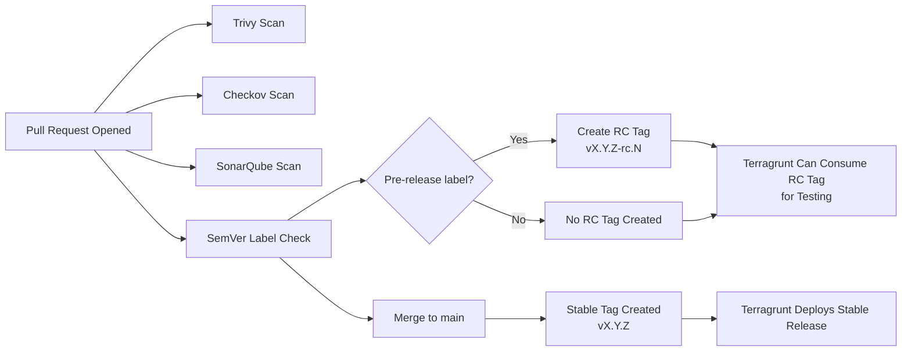

# Core Cloud GitHub Enterprise Terraform Module

This repository contains the core Terraform modules for the Core Cloud Github Enterprise.

## Repository Structure

```text
── .github
│   ├── CODEOWNERS
│   ├── ISSUE_TEMPLATE
│   │   ├── bug_report.md
│   │   └── feature_request.md
│   ├── labels.yml
│   ├── PULL_REQUEST_TEMPLATE.md
│   └── workflows
│       ├── pull-request-sast.yaml
│       ├── pull-request-semver-label-check.yaml
│       └── pull-request-semver-tag-merge.yaml
├── catalog-info.yaml
├── CODE_OF_CONDUCT.md
├── CODEOWNERS
├── CONTRIBUTING.md
├── modules
│   └── core-cloud-ghes-terraform
│       ├── main.tf
│       ├── outputs.tf
│       ├── README.md
│       └── variables.tf
└── README.md
```

The following modules are available:

- [Core Cloud GHES Terraform Module](./modules/core-cloud-ghes-terraform/)

## Example Usage
Example usage can be found in the README of the module. 


## Static Analysis and Code Quality

This repository is automatically scanned by `Checkov` and `SonarQube` through GitHub Actions workflows located in `.github/workflows/checkov-sonar-scan.yaml`

### Checkov Security and Compliance Scan

* Runs on every *Pull Request* and *push* to `main` that modifies files under `modules/core-cloud-ghes-terraform/`.

* Uses the internal reusable workflow: `UKHomeOffice/core-cloud-workflow-checkov-sast-scan@1.7.0.`

* Performs Infrastructure-as-Code (IaC) *security, compliance, and policy validation* against Terraform configurations.

Results are visible under the **Actions** tab in the job summary (and optionally in GitHub’s **Code Scanning Alerts** view).

### SonarQube Code Quality Scan

* Uses the internal action: `UKHomeOffice/core-cloud-workflow-sonarqube-scan@1.1.4.`

* Analyzes Terraform code quality, maintainability, and duplication metrics for the `modules/core-cloud-ghes-terraform directory`.

* The scan results are available in the **SonarQube dashboard** at:
🔗 https://sonarqube.cc-platform-ops-tooling-live-1.core.homeoffice.gov.uk

### Enforcement Level

* Both **Checkov** and **SonarQube** currently run in **advisory** mode.

    * Checkov: reports policy violations but does not **block merges** in this repository.

    * SonarQube: quality gate status is evaluated but **not enforced** as a merge gate.

* These scans provide early visibility into security and quality issues in shared Terraform modules consumed by other infrastructure repositories.

### Semantic Versioning and Trivy Scan
In addition to static analysis, this repository enforces semantic versioning and performs Terraform validation using Trivy.
The following GitHub Actions workflows manage version control hygiene and code validation:

| Workflow File                                                                                                      | Purpose                                                                                                                            |
| :----------------------------------------------------------------------------------------------------------------- | :--------------------------------------------------------------------------------------------------------------------------------- |
| [`.github/workflows/pull-request-sast.yaml`](.github/workflows/pull-request-sast.yaml)                             | Runs a **Trivy** scan to validate Terraform syntax and detect security misconfigurations in pull requests.                         |
| [`.github/workflows/pull-request-semver-label-check.yaml`](.github/workflows/pull-request-semver-label-check.yaml) | Ensures each pull request includes an appropriate **Semantic Version (SemVer)** label (`major`, `minor`, or `patch`) before merge. |
| [`.github/workflows/pull-request-semver-tag-merge.yaml`](.github/workflows/pull-request-semver-tag-merge.yaml)     | Automatically applies a **SemVer tag** to the main branch when changes are merged, enabling versioned module releases.             |

### How It Works

* When a pull request is opened, **Trivy** validates Terraform code and scans for common vulnerabilities.

* The **SemVer label check** ensures versioning discipline is maintained across releases.

* Upon merge to `main`, a **SemVer tag** is generated (e.g., `v1.5.0`), which can then be referenced by   Terragrunt and other consumer repositories via:

```hcl
terraform {
  source = "git::https://github.com/UKHomeOffice/core-cloud-github-enterprise-terraform//?ref=v1.5.0"
}
```
📈 CI/CD Workflow Overview

This repository uses a fully automated CI/CD workflow to ensure that all Terraform module changes are scanned, validated, versioned, and released in a consistent and safe manner.

The workflow includes:

* Security and quality scanning

* SemVer-based automated versioning

* Pre-release (RC) tagging for testing changes before merging

* Stable release tagging on merge to main

The full process is illustrated below.

📊 End-to-End CI/CD Flow (including RC Tags)


### 🔍 Summary:

Every pull request runs full validation (Trivy, Checkov, SonarQube) and SemVer label checks.  
Optional RC tags allow engineers to test module changes in Terragrunt before merging.  
Merging to `main` automatically creates a stable SemVer release tag ready for downstream deployment.


🏷️ Versioning & Release Strategy

This repository follows Semantic Versioning (SemVer):

| Label         | Meaning                           | Example Output |
| ------------- | --------------------------------- | -------------- |
| `major`       | Breaking changes                  | `v2.0.0`       |
| `minor`       | Backwards-compatible changes      | `v1.7.0`       |
| `patch`       | Fixes / safe updates              | `v1.6.1`       |
| `pre-release` | Modifier used to generate RC tags | `v1.7.0-rc.1`  |


🔹 Pre-Release (RC) Tags

When a PR is labelled with:

* Exactly one of: major, minor, or patch

* Plus: pre-release

Then the workflow automatically generates a pre-release tag:

* `vX.Y.Z-rc.1`
* `vX.Y.Z-rc.2`

Engineers can use these RC tags in Terragrunt to test module changes before merging to main by calling it like this:

```hcl
terraform {
  source = "git::https://github.com/UKHomeOffice/core-cloud-github-enterprise-terraform.git//modules/core-cloud-ghes-terraform?ref=vX.Y.Z-rc.N"
}

```

🔹 Stable Releases

Once the PR is approved and merged to main, the merge workflow automatically generates a stable SemVer tag: `vX.Y.Z`


These stable tags are used for normal deployment through Terragrunt environments.

🛡️ Security & Quality Scanning

All PRs to this repository run:

* **Trivy** – Terraform security & misconfiguration scanning

* **Checkov** – Deep Terraform IaC policy scanning

* **SonarQube** – Code quality and static analysis

These scans are **advisory** and do not block merges, but all issues are visible in GitHub Actions and SonarQube dashboards.

